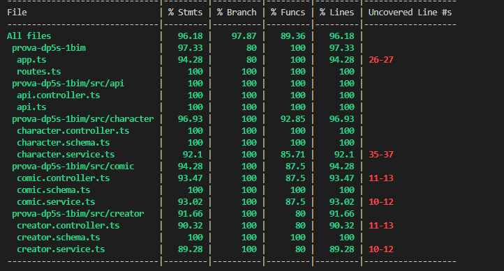
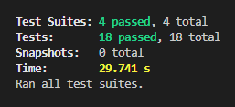
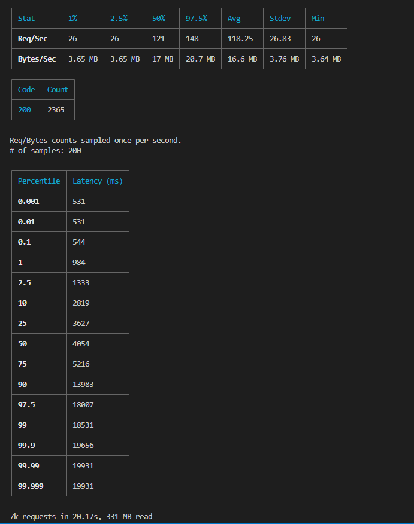

# Documentação da API

A seguir está a documentação da API para a entidade "Personagens" da saga escolhida.

## Rotas

#### Criação do Banco de Dados da Saga

**Método:** `GET`

**Endpoint:** `/createDB`

Cria o banco de dados da saga populando-o com dados obtidos da API da Marvel.

### Personagens

### Criação de um Personagem

**Método:** `POST`

**Endpoint:** `/character`

Cria um novo personagem na saga.

#### Parâmetros da Requisição

| Nome         | Tipo   | Descrição             |
|--------------|--------|-----------------------|
| name         | String | Nome do personagem    |
| description  | String | Descrição do personagem |
| img          | String | URL da imagem do personagem |

#### Exemplo de Requisição
```json
{
    "name": "Homem de Ferro",
    "description": "Um bilionário excêntrico e inventor brilhante, Tony Stark cria uma armadura poderosa para se tornar o super-herói conhecido como Homem de Ferro.",
    "img": "https://example.com/ironman.jpg"
}
```

#### Exemplo de Resposta
```json
{
    "_id": "60a40cbdbe650f4ef364b6a3",
    "name": "Homem de Ferro",
    "description": "Um bilionário excêntrico e inventor brilhante, Tony Stark cria uma armadura poderosa para se tornar o super-herói conhecido como Homem de Ferro.",
    "img": "https://example.com/ironman.jpg",
    "createdAt": "2022-05-18T12:30:05.000Z",
    "updatedAt": "2022-05-18T12:30:05.000Z"
}
```

### Atualização de um Personagem

**Método:** `POST`

**Endpoint:** `/character/:id`

Atualiza os detalhes de um personagem existente na saga.

#### Parâmetros da Requisição

| Nome         | Tipo   | Descrição             |
|--------------|--------|-----------------------|
| id           | String | ID do personagem a ser atualizado |
| name         | String | Nome atualizado do personagem    |
| description  | String | Descrição atualizada do personagem |
| img          | String | URL da imagem atualizada do personagem |

#### Exemplo de Requisição
```json
{
    "name": "Homem de Ferro - Tony Stark",
    "description": "Um bilionário excêntrico e inventor brilhante, Tony Stark cria uma armadura poderosa para se tornar o super-herói conhecido como Homem de Ferro.",
    "img": "https://example.com/ironman-new.jpg"
}
```

#### Listagem de Todos os Personagens

**Método:** `GET`

**Endpoint:** `/character`

Retorna todos os personagens da saga.

#### Busca de um Personagem por ID

**Método:** `GET`

**Endpoint:** `/character/:id`

Retorna os detalhes de um personagem específico da saga com base no ID fornecido.

#### Exclusão de um Personagem

**Método:** `DELETE`

**Endpoint:** `/character/:id`

Exclui um personagem da saga com base no ID fornecido.

#### Busca de um Personagem por Nome

**Método:** `GET`

**Endpoint:** `/character/nome/:name`

Retorna os detalhes de um personagem da saga com base no nome fornecido.

#### Busca de Quadrinhos de um Personagem

**Método:** `GET`

**Endpoint:** `/character/comicCharacter/:name`

Retorna os quadrinhos em que um personagem específico da saga aparece, com base no nome fornecido.

### Quadrinhos

#### Criação de um Quadrinho

**Método:** `POST`

**Endpoint:** `/comic`

Cria um novo quadrinho na saga.

#### Atualização de um Quadrinho

**Método:** `POST`

**Endpoint:** `/comic/:id`

Atualiza os detalhes de um quadrinho existente na saga.

#### Listagem de Todos os Quadrinhos

**Método:** `GET`

**Endpoint:** `/comic`

Retorna todos os quadrinhos da saga.

#### Busca de um Quadrinho por ID

**Método:** `GET`

**Endpoint:** `/comic/:id`

Retorna os detalhes de um quadrinho específico da saga com base no ID fornecido.

#### Exclusão de um Quadrinho

**Método:** `DELETE`

**Endpoint:** `/comic/:id`

Exclui um quadrinho da saga com base no ID fornecido.

#### Busca de Quadrinhos por Título

**Método:** `GET`

**Endpoint:** `/comic/titulo/:title`

Retorna os quadrinhos da saga que correspondem ao título fornecido.

#### Busca de Quadrinhos por Criador

**Método:** `GET`

**Endpoint:** `/comic/creator/:creator`

Retorna os quadrinhos da saga que foram criados pelo criador fornecido.

#### Busca de Criadores por Função

**Método:** `GET`

**Endpoint:** `/comic/creator/role/:role`

Retorna os criadores da saga que possuem a função fornecida.

### Criadores

#### Criação de um Criador

**Método:** `POST`

**Endpoint:** `/creator`

Cria um novo criador na saga.

#### Atualização de um Criador

**Método:** `POST`

**Endpoint:** `/creator/:id`

Atualiza os detalhes de um criador existente na saga.

#### Listagem de Todos os Criadores

**Método:** `GET`

**Endpoint:** `/creator`

Retorna todos os criadores da saga.

#### Busca de um Criador por ID

**Método:** `GET`

**Endpoint:** `/creator/:id`

Retorna os detalhes de um criador específico da saga com base no ID fornecido.

#### Exclusão de um Criador

**Método:** `DELETE`

**Endpoint:** `/creator/:id`

Exclui um criador da saga com base no ID fornecido.

## Controller

### CharacterController

O `CharacterController` é responsável por lidar com as requisições relacionadas aos personagens da saga.

#### Métodos

- `create`: Cria um novo personagem.
- `findById`: Encontra um personagem pelo ID.
- `findAll`: Retorna todos os personagens.
- `updateById`: Atualiza um personagem pelo ID.
- `deleteById`: Exclui um personagem pelo ID.
- `findByName`: Encontra um personagem pelo nome.
- `findComicsByCharacter`: Retorna os quadrinhos em que um personagem específico aparece.

### ComicController

O `ComicController` é responsável por lidar com as requisições relacionadas aos quadrinhos da saga.

#### Métodos

- `create`: Cria um novo quadrinho.
- `findById`: Encontra um quadrinho pelo ID.
- `findAll`: Retorna todos os quadrinhos.
- `updateById`: Atualiza um quadrinho pelo ID.
-

 `deleteById`: Exclui um quadrinho pelo ID.
- `findByTitle`: Encontra quadrinhos pelo título.
- `findByCreator`: Encontra quadrinhos pelo criador.
- `findCreatorsByRole`: Encontra criadores pelo papel.

### CreatorController

O `CreatorController` é responsável por lidar com as requisições relacionadas aos criadores da saga.

#### Métodos

- `create`: Cria um novo criador.
- `findById`: Encontra um criador pelo ID.
- `findAll`: Retorna todos os criadores.
- `updateById`: Atualiza um criador pelo ID.
- `deleteById`: Exclui um criador pelo ID.

## Schema

### CharacterSchema

O `CharacterSchema` é o esquema do Mongoose que define a estrutura de dados para a entidade "Personagem".

Campos:

- `id`: ID numérico do personagem.
- `name`: Nome do personagem.
- `description`: Descrição do personagem.
- `img`: URL da imagem do personagem.
- `comics`: Array de quadrinhos em que o personagem aparece.

### ComicSchema

O `ComicSchema` é o esquema do Mongoose que define a estrutura de dados para a entidade "Quadrinhos".

Campos:

- `id`: ID numérico do quadrinho.
- `title`: Título do quadrinho.
- `description`: Descrição do quadrinho.
- `publicationDate`: Data de publicação do quadrinho.
- `cover`: URL da capa do quadrinho.
- `creators`: Array de criadores do quadrinho.

### CreatorSchema

O `CreatorSchema` é o esquema do Mongoose que define a estrutura de dados para a entidade "Criadores".

Campos:

- `id`: ID numérico do criador.
- `name`: Nome do criador.
- `img`: URL da imagem do criador.

## Service

### CharacterService

O `CharacterService` é responsável por fornecer métodos para manipular dados relacionados aos personagens da saga.

#### Métodos

- `create`: Cria um novo personagem.
- `findById`: Encontra um personagem pelo ID.
- `findAll`: Retorna todos os personagens.
- `updateById`: Atualiza um personagem pelo ID.
- `deleteById`: Exclui um personagem pelo ID.
- `findByName`: Encontra um personagem pelo nome.
- `findComicsByName`: Retorna os quadrinhos em que um personagem específico aparece.

### ComicService

O `ComicService` é responsável por fornecer métodos para manipular dados relacionados aos quadrinhos da saga.

#### Métodos

- `create`: Cria um novo quadrinho.
- `findById`: Encontra um quadrinho pelo ID.
- `findAll`: Retorna todos os quadrinhos.
- `updateById`: Atualiza um quadrinho pelo ID.
- `deleteById`: Exclui um quadrinho pelo ID.
- `findByTitle`: Encontra quadrinhos pelo título.
- `findByCreator`: Encontra quadrinhos pelo criador.
- `findCreatorsByRole`: Encontra criadores pelo papel.

### CreatorService

O `CreatorService` é responsável por fornecer métodos para manipular dados relacionados aos criadores da saga.

#### Métodos

- `create`: Cria um novo criador.
- `findById`: Encontra um criador pelo ID.
- `findAll`: Retorna todos os criadores.
- `updateById`: Atualiza um criador pelo ID.
- `deleteById`: Exclui um criador pelo ID.

Esta documentação abrangente descreve as rotas disponíveis, os controladores que manipulam as requisições, os esquemas que definem a estrutura de dados e os serviços que fornecem métodos para manipular esses dados. Certifique-se de usar essas informações ao interagir com a API.


#### Relatorio dos testes
## Coverage


## Resultado dos testes


## Resultado do teste de carga com Autocannon
